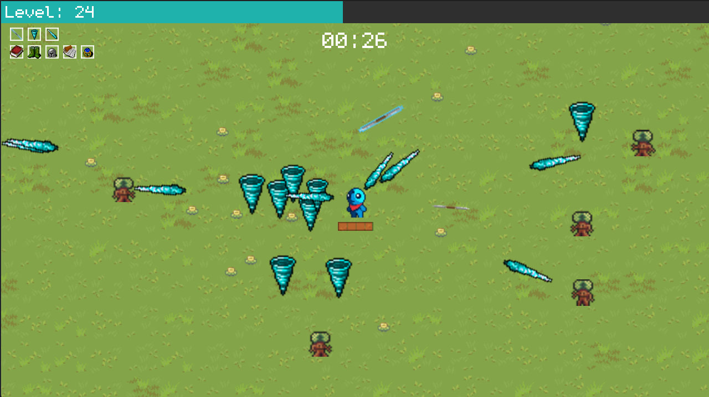

# Andy's Adventure
This is a final projet for my college course called multimedia and game design. 
It's a clone of a popular game called Vampire Survivors, created solely for educational purposes.

## Table of contents
- [Andy's Adventure](#andys-adventure)
  - [Table of contents](#table-of-contents)
  - [Overview](#overview)
    - [Screenshot](#screenshot)
  - [Our process](#our-process)
    - [Built with](#built-with)
  - [Authors](#authors)
  - [Credits](#credits)

## Overview

### Screenshot

## Our process

### Built with

- GDScript
- Godot engine

## Authors

- Piotr Baloń
- Sebastian Stochmiał
- Przemysław Latusik

## Credits 
All assets are free and taken from [itch.io](https://itch.io/).
Here's a list of asset packs used for this project:
- [Sprout Lands](https://cupnooble.itch.io/sprout-lands-asset-pack)
- [Pixel Art Top Down](https://cainos.itch.io/pixel-art-top-down-basic)
- [Tiny Hero Sprites Pixel Art](https://free-game-assets.itch.io/free-tiny-hero-sprites-pixel-art)
- [Undead executioner](https://darkpixel-kronovi.itch.io/undead-executioner)
- [Magical Asset Pack](https://deepdivegamestudio.itch.io/magical-asset-pack)
- [Free Interface UI Kit #4](https://wenrexa.itch.io/ui-different02)
- [monogram](https://datagoblin.itch.io/monogram)